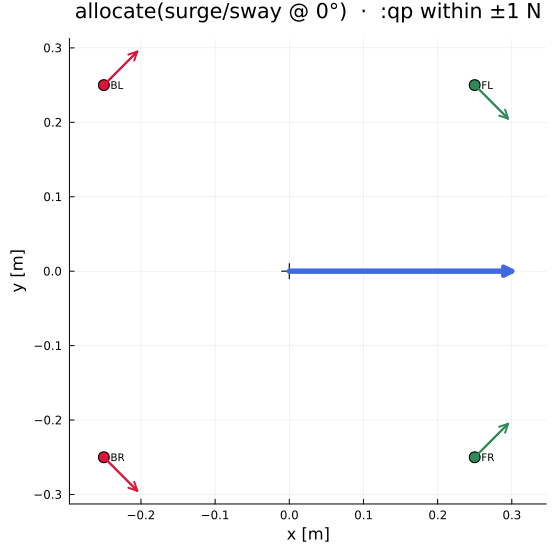
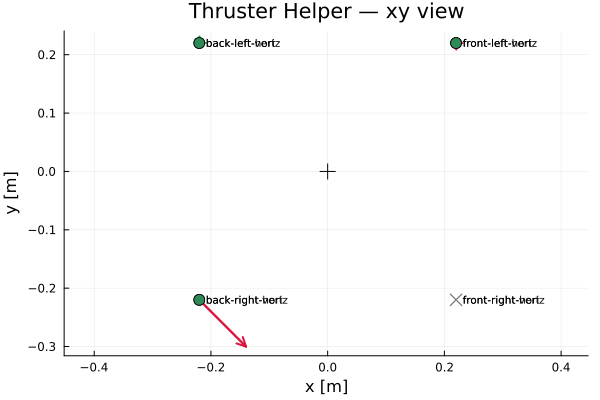
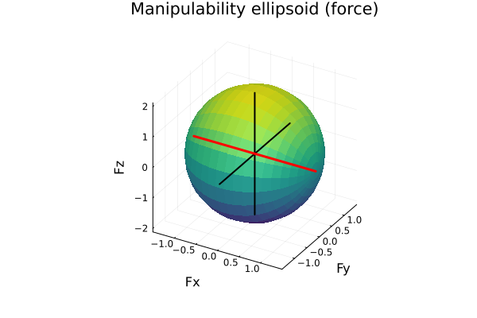

# Thruster Helper

*Julia package: `ThrusterHelper.jl`*

[](https://github.com/wuisabel-gif/ThrusterHelper.jl/actions/workflows/CI.yml)
[](LICENSE)
[](https://julialang.org)
[](https://juliahub.com/ui/Packages/General/ThrusterHelper)
[](https://wuisabel-gif.github.io/ThrusterHelper.jl/dev)
[](Project.toml)

A small, dependency-light Julia toolkit for **thruster / actuator allocation and
control-authority analysis**. It turns a desired 6-DOF wrench into individual
actuator commands — and, just as importantly, analyses the *design* itself: rank,
conditioning, redundancy, failure modes and power. The whole arc, from thruster
geometry to a real-time-safe C++ mixer, runs on a laptop *before* the vehicle
touches the water.

Built for AUVs and RoboSub-style ROVs, but the math is vehicle-agnostic — a
spacecraft reaction-wheel cluster flows through the same pipeline.

> *Created: 25 Jun 2026*

---

## Demo

<p align="center">
  
</p>

*The core loop in motion: a rotating surge/sway command (blue arrow), with each
thruster's response solved live by the `:qp` allocator within its ±1 N limit
(green = forward, red = reverse). Generated by
[`examples/animate_allocation.jl`](examples/animate_allocation.jl).*

```bash
julia --project=. examples/demo.jl
```

runs the whole loop — geometry → allocate → diagnose → optimise → ship — end to
end. Real output from that run:

```text
$ julia --project=. examples/demo.jl
2. Allocate a command: forward + yaw right
Actuator commands:
  front-right-horiz        0.7553                      |████████████████████
  back-right-horiz        -0.7553  ████████████████████|
  ...
  rank / condition #  : 6/6  ,  κ = 4.545

4. Can it actually do this? (reachability)
Reachability: NOT REACHABLE ✗
  UNREACHABLE: Fx short by 1.1716; 4 actuators saturated

7. Design, not just analyse: optimise a cramped layout
  objective score : 10 → 7.402  (26.0% better)
  condition κ     : 10.000 → 7.402

8. Ship it: generate a real-time-safe C++ header
wrote thruster_allocation.hpp — no Julia dependency at runtime
```

No hardware, no simulator, no plotting dependency required — just Julia. See
[`examples/demo.jl`](examples/demo.jl) for the full 8-step script, or the
[`examples/`](examples) directory for ~20 focused one-feature scripts.

With the optional `Plots` extension (`examples/plot_layout.jl` /
`examples/plot_ellipsoid.jl`):

 

*Left: force-vector layout for a forward+yaw command with two thrusters failed
(grey ✕) and one reversed (red). Right: the manipulability ellipsoid — long
axes are cheap directions, the red axis is the design's weak spot.*

---

## Background

I like building robotics software before building robotics hardware.

One lesson I learned from working on underwater robots is that many problems can
be discovered long before the vehicle touches the water. A controller might be
perfectly correct, yet the robot still cannot move the way you expect because
the thruster geometry is wrong. A vehicle may lose an entire degree of freedom
after one thruster fails. A layout might look symmetric but actually wastes
power because the allocation is poorly conditioned.

Thruster Helper started as an excuse to learn Julia while exploring these
problems. The project is intentionally small. It focuses on one task: given a
desired force and torque on an underwater vehicle, determine what each thruster
should do. Around that core idea are tools for understanding the vehicle
itself — its control authority, redundancy, failure modes, and power usage.

This is **not** intended to replace a flight controller or a ROS 2 control
stack. It is a lightweight toolkit for experimenting with thruster layouts and
allocation algorithms. The goal is to keep it dependency-light and easy to read:
someone interested in underwater robotics should be able to understand the
entire allocation pipeline in an afternoon.

### Why Julia?

I wanted a language that makes numerical computing pleasant, and Julia feels
like a good middle ground:

- Interactive like Python
- Fast enough for heavy matrix computation
- Multiple dispatch makes linear-algebra code natural
- Excellent scientific-computing ecosystem
- Easy to prototype algorithms before rewriting them in C++ if necessary

Most of Thruster Helper is simply linear algebra — exactly the kind of work Julia
was designed for.

---

## Why this matters

Pool time and field time are the expensive, limited resource on any AUV/ROV
project — every hour spent debugging thruster wiring in the water is an hour
not spent testing the mission itself. Most allocation bugs are geometric and
catchable on a laptop before that:

- **A layout that looks fine on paper can be under-actuated.** `diagnostics`
  and `controllable_dofs` catch a missing DOF (e.g. no heave authority) before
  the first wet test, not after.
- **"What if thruster 3 dies?" has a knowable answer.** `rank_failures` and
  `monte_carlo` turn "probably fine" into a rank/condition-number number, so a
  team can decide *in advance* whether a failure is recoverable or mission-ending.
- **A command that looks reachable on the controller side may not be, once
  saturation is accounted for.** `reachable` and the `:qp` solver are the
  difference between "the allocator returned numbers" and "the vehicle can
  actually do this."
- **The result isn't stuck in a notebook.** `export_cpp` turns the analysis
  into a dependency-free header that runs on the real flight controller, so the
  same math that was checked in Julia is what ships.

None of this is specific to one team's vehicle — the `AbstractActuator`/`Vehicle`
abstraction means a RoboSub ROV, a research AUV, or a spacecraft reaction-wheel
cluster all go through the same checks. The point isn't the linear algebra
(`pinv` is one line); it's catching a bad design *before* it costs a pool
session, a competition run, or a mission.

---

## The problem it solves

An AUV controller does not command individual motors. It asks the vehicle to
generate a wrench (force + torque):

```text
τ = [Fx, Fy, Fz, τx, τy, τz]
     │   │   │   │   │   └─ τz = yaw
     │   │   │   │   └───── τy = pitch
     │   │   │   └───────── τx = roll
     │   │   └───────────── Fz = heave
     │   └───────────────── Fy = sway
     └───────────────────── Fx = surge
```

but the vehicle only has individual thrusters:

```text
f = [f1, f2, …, fN]
```

Thruster Helper builds the **allocation matrix** `B` so that

```text
τ = B f
```

and then solves the inverse problem for the actuator commands — with a choice of
algorithms, not just the pseudo-inverse:

```text
f = allocate(B, τ; method = :minimum_norm)   # f = pinv(B) τ
                 | :weighted                  # penalise chosen actuators
                 | :minimum_power             # minimise Σ|fᵢ|^1.5  (IRLS)
                 | :qp                        # best wrench within ±limits
```

so Thruster Helper is a small **framework for comparing allocation methods**, not a
single `pinv` wrapper.

### Core concept

Each thruster contributes a force (its push direction) and a torque
(`position × direction`), so it becomes one column of `B`:

```text
B[:, i] = [ direction_x
            direction_y
            direction_z
            (position × direction)_x
            (position × direction)_y
            (position × direction)_z ]
```

`pinv(B)` returns the **minimum-effort** (least-‖f‖) solution that hits the
command, or the least-squares closest wrench when the geometry can't fully
achieve it.

That sounds simple, but many interesting questions appear immediately — and
they are exactly what this project tries to answer:

- Is every degree of freedom controllable?
- Which thruster contributes most to yaw?
- What happens after a thruster failure?
- Which motors saturate first?
- How much extra power does redundancy cost?

---

## Install / run

Requires Julia ≥ 1.9 (the optional Plots support uses package extensions, which
need 1.9+).

Install from Julia's **General registry**:

```julia
using Pkg; Pkg.add("ThrusterHelper")
```

Full API docs are online at
<https://wuisabel-gif.github.io/ThrusterHelper.jl/dev>. To develop against a
local clone:

```bash
julia --project=. -e 'using Pkg; Pkg.instantiate()'   # one-time
julia --project=. -e 'using Pkg; Pkg.test()'          # run the test suite
julia --project=. examples/forward.jl                 # run an example
```

The core has **no third-party dependencies** (only the `LinearAlgebra`, `Printf`
and `Random` standard libraries). Graphical plotting is optional and only pulls
in `Plots` if you ask for it (see [Plotting](#plotting)).

---

## Quick start

```julia
using ThrusterHelper

# A built-in 8-thruster vehicle (BlueROV2 Heavy / RoboSub style).
vehicle = bluerov_vehicle()

# Ask for a motion: forward + yaw right.
τ = [1.0, 0.0, 0.0, 0.0, 0.0, 0.5]

# Solve for thruster commands (saturation-aware QP here).
result = allocate(vehicle, τ; method = :qp)
report(result; actuators = vehicle.actuators)

# Analyse the design itself, separately from any one command.
report(diagnostics(vehicle))
```

Allocation report (abridged):

```text
Actuator commands:
  front-right-horiz        0.7553   |████████████████████
  front-left-horiz        -0.0482  █|
  back-right-horiz        -0.7553  ████████████████████|
  ...
Summary:
  total |command|     : 1.6071
  est. power          : 1.3341 W
  most-loaded actuator: back-right-horiz (-0.7553)
  rank / condition #  : 6/6  ,  κ = 4.545
```

---

## The `Vehicle` and actuators

An actuator is anything that turns a scalar command into a 6-DOF wrench — the
`AbstractActuator` interface. The built-in `Thruster` is a position, a push
**direction** (auto-normalised), and a `max_thrust`. Convention: **x forward,
y left, z up**, positions about the centre of mass. Bundle actuators into a
`Vehicle` so the API reads naturally:

```julia
thrusters = [
    Thruster("port-surge", [0.2,  0.15, 0.0], [1, 0, 0]; max_thrust = 40.0),
    Thruster("stbd-surge", [0.2, -0.15, 0.0], [1, 0, 0]; max_thrust = 40.0),
    Thruster("port-heave", [0.0,  0.15, 0.0], [0, 0, 1]; max_thrust = 40.0),
    Thruster("stbd-heave", [0.0, -0.15, 0.0], [0, 0, 1]; max_thrust = 40.0),
]
vehicle = Vehicle("my-auv", thrusters; mass = 12.0)

allocation_matrix(vehicle)        # 6×N matrix B
allocate(vehicle, τ; method = :qp)
diagnostics(vehicle)              # rank, conditioning, control authority …
describe(vehicle)                 # geometry table
```

`Thruster` is **immutable** — a vehicle does not move its thrusters at run time;
build a new one to change geometry. Built-in layouts: `bluerov_heavy(; arm,
span)` / `bluerov_vehicle()` (8 thrusters, fully actuated), `simple_quad(;
arm)` / `quad_vehicle()` (4 horizontal thrusters; surge/sway/yaw only), and
`cubesat_pyramid(; cant_deg)` / `cubesat_vehicle()` (4 reaction wheels; 3-axis
attitude control, single-fault tolerant).

---

## Allocation solvers

`allocate(B_or_vehicle, τ; method = …)` chooses the algorithm. All are
dependency-free (built on `LinearAlgebra`).

| `method` | Solves | Use for |
|---|---|---|
| `:minimum_norm` / `:pinv` | min ‖f‖₂ s.t. `Bf = τ` | default, least-effort |
| `:weighted` | min ‖W f‖₂ s.t. `Bf = τ` | penalise weak / suspect actuators (`weights=`) |
| `:minimum_power` | min Σ\|fᵢ\|ᵖ s.t. `Bf = τ` (IRLS, p≈1.5) | lower electrical draw |
| `:qp` | min ‖Bf − τ‖² s.t. `lo ≤ f ≤ hi` | respect saturation limits optimally (`bounds=`) |

`allocate` returns an `AllocationResult` with `commands`, `desired`, `achieved`
(`= B·commands`) and `residual` (`achieved − desired`). A non-zero residual is
the headline diagnostic: the geometry — or the surviving thrusters after a
failure — cannot meet the command. See `examples/solver_comparison.jl`.

> **Why not just use `pinv`?** `pinv(B) τ` is the right answer to a narrower
> question — least-‖f‖ with *no other constraints*. It silently ignores
> saturation limits, electrical power, failed thrusters and per-actuator
> weighting. Thruster Helper exists to handle exactly those: `:qp` respects limits,
> `:minimum_power` targets draw, `:weighted` steers around weak actuators,
> `apply_failures` models dead ones, and `reachable` tells you when *no* command
> suffices. `:minimum_norm` is still there for when `pinv` really is what you want.

---

## Design diagnostics

Allocation tells you the thrust values; **diagnostics** tell you whether the
*design* is any good. `diagnostics(B_or_vehicle)` returns an
`AllocationDiagnostics` with:

- `rank` — `6` ⇒ fully actuated; lower ⇒ DOFs are uncontrollable.
- `redundancy` — `N − rank`, the null-space / spare control dimension.
- `condition_number` — `σ_max/σ_min`; large ⇒ some directions need far more thrust (`Inf` when rank-deficient, matching `cond(B)`).
- `manipulability` — `√det(B Bᵀ)`, volume of the achievable-wrench ellipsoid.
- `controllable` — `Bool` per DOF `[Fx, Fy, Fz, τx, τy, τz]`.
- `singular_values`, `weakest_direction`, `weakest_gain` — the SVD picture.

```julia
report(diagnostics(vehicle))
```

```text
Design diagnostics  (6 DOF × 8 actuators)
  rank               : 6 / 6  (fully actuated)
  redundancy (null)  : 2
  condition number κ : 4.545  (well-conditioned)
  manipulability     : 0.4819
  control authority  : Fx ok  Fy ok  Fz ok  τx ok  τy ok  τz ok
  singular values    : [2.0, 1.414, 1.414, 0.622, 0.44, 0.44]
  weakest direction  : τx-dominated, gain σ_min = 0.44
```

The LinearAlgebra primitives the analysis is built on (`rank`, `cond`, `svd`,
`svdvals`, `nullspace`, `eigen`, `pinv`) are re-exported, so `using ThrusterHelper`
is enough to reach for them directly on `B`.

---

## Analysis & design tools

Built on the core, these answer the questions a vehicle *designer* asks:

| Tool | Question it answers |
|---|---|
| `reachable(vehicle, τ)` | Can the vehicle produce this wrench within its limits? If not, what's the closest, and which thrusters saturate? |
| `compare_methods(vehicle, τ)` | Which solver wins here? Tabulates residual, ‖f‖₂, power, saturation, time. |
| `rank_failures(vehicle; pairs=…)` | How critical is each thruster? Rank/κ change and lost DOFs for every failure (or pair). |
| `monte_carlo(vehicle; misalignment_deg, failure_prob, …)` | How robust is the design? P(lose each DOF) and the κ distribution over thousands of perturbed builds. |
| `optimize_layout(vehicle; objective, free)` | **Design**, not just analyse: re-aim (and/or move) thrusters to minimise κ or maximise manipulability. |

```julia
reachable(vehicle, [30, 0, 0, 0, 0, 0])      # "Fx = 30 N? Vehicle tops out at 22 N." → NOT REACHABLE
report(compare_methods(vehicle, τ))          # solver trade-off table
report_failures(rank_failures(vehicle))      # failure criticality ranking
report(monte_carlo(vehicle; misalignment_deg=2.0, failure_prob=0.05))

# Turn an analysis library into a design tool:
res = optimize_layout(bluerov_vehicle(; arm=0.1); objective=:condition_number)
report(res)        # κ: 10.0 → 7.2 by re-aiming thrusters, still full rank
```

The optimiser is a dependency-free pattern search with random restarts; pass
`free=:both` and a `position_box` to move thrusters as well as re-aim them, or a
custom `objective = vehicle -> …` to minimise. See the `reachability.jl`,
`compare_methods.jl`, `failure_analysis.jl`, `monte_carlo.jl` and
`optimize_layout.jl` examples.

---

## Shared power / current budgets

Thrusters are often ganged on power boards, or share a battery / ESC current
limit — a constraint that per-actuator bounds can't express. Three composable,
dependency-free helpers cover it:

| Tool | What it does |
|---|---|
| `estimate_current(f; k, p, k_reverse)` | Per-actuator current draw as `∝ \|f\|ᵖ`, with an optional separate reverse coefficient (many thrusters draw more current per unit thrust in reverse). |
| `group_totals(x, groups)` | Sum any per-actuator quantity (current, power, thrust…) over arbitrary index groups — power boards, thermal zones, hydraulic circuits. |
| `allocate_grouped(vehicle, τ; groups, budgets, …)` | Allocate a wrench while keeping each group within its shared budget, on top of the per-actuator limits. |

```julia
boards = [1:4, 5:8]                                   # two power boards
I = estimate_current(f; k = 0.067, k_reverse = 0.103) # 6 A @ 20 N fwd / 15 N rev
group_totals(I, boards)                               # per-board current draw

# Enforce a shared budget while staying within thruster limits:
r = allocate_grouped(vehicle, τ; groups = boards, budgets = 24,
                     k = 0.067, k_reverse = 0.103)
```

`allocate_grouped` reuses the `:qp` inner solve, so per-actuator limits are
**always** respected; the residual grows if the wrench can't be met within the
budgets. It's a heuristic (box-tightening on over-budget groups), not the
optimal constrained QP. Nothing vehicle-specific is baked in — groups, current
anchors and budgets are all caller-supplied. See `examples/board_budget.jl`.

---

## Beyond AUVs

The math is not underwater-specific — any rigid body whose actuators sum to a
wrench fits. Actuators are an `AbstractActuator` hierarchy, so a spacecraft
`ReactionWheel` (pure torque about an axis) drops into the same pipeline:

```julia
sat = cubesat_vehicle()          # built-in 4-reaction-wheel pyramid (single-fault tolerant)
report(diagnostics(sat))         # τx/τy/τz controllable; forces are not
allocate(sat, [0,0,0, 0,0,0.002])            # command a yaw torque (N·m)
report_failures(rank_failures(sat))          # lose any one wheel → still rank 3
```

`cubesat_vehicle()` / `cubesat_pyramid()` are the spacecraft analogue of
`bluerov_vehicle()` — an off-the-shelf reference cluster (à la Blue Canyon RWP /
CubeSpace CubeWheel). A wheel craft makes no force, so `condition_number` is
`Inf` over the full 6 DOF; the meaningful metric is `cond(B[4:6, :])` (the torque
sub-block) or `plot_manipulability(sat; block=:torque)`. See
`examples/spacecraft_reaction_wheels.jl`. New actuator types just implement
`wrench_column` and `command_limits`.

---

## Deploying to firmware / ROS 2

`export_cpp(vehicle)` bakes any vehicle's allocation into a self-contained,
dependency-free C++17 header — no Julia or ThrusterHelper needed at runtime:

```julia
export_cpp(bluerov_vehicle(); path = "thruster_allocation.hpp")
```

```cpp
#include "thruster_allocation.hpp"
auto f = thruster_allocation::allocate({Fx, Fy, Fz, taux, tauy, tauz});
```

`:minimum_norm` and `:weighted` reduce to a fixed matrix once geometry is
chosen, so the header just does a constant-size matrix-vector multiply and a
direction-preserving saturation clamp — O(N), no heap, no iteration, real-time
safe. (`:qp`/`:minimum_power` are iterative and don't export.) This works for
any vehicle built with this package, not one particular AUV — swap in your own
thruster layout and regenerate. See `examples/export_cpp.jl`.

---

## Plotting

Plotting is an optional [package extension](https://pkgdocs.julialang.org/v1/creating-packages/#Conditional-loading-of-code-in-packages-(Extensions)).
The core never loads `Plots`; it activates only when you do:

```julia
using ThrusterHelper
using Plots                      # triggers ThrusterHelperPlotsExt

vehicle = bluerov_vehicle()
r = allocate(vehicle, [1, 0, 0, 0, 0, 0.5]; method = :qp)
plot_vehicle(vehicle; commands = r.commands, failed = [1, 5], view = :xy)
```

`view` can be `:xy` (top-down), `:xz` (side) or `:yz` (rear). Forward thrust is
green, reverse is red, failed thrusters are greyed with an ✕. (`plot_thrusters`
takes the actuator vector directly.)

`plot_manipulability(vehicle; block=:force)` draws the 3-D **manipulability
ellipsoid** — the set of wrenches reachable with a unit command ball. Its long
axes are cheap-to-produce directions; the short (red) axis is the design's weak
spot. See `examples/plot_ellipsoid.jl`.

---

## Examples

~15 small, focused scripts — run with `julia --project=. examples/<name>.jl`.
A few highlights (see [`examples/README.md`](examples/README.md) for the full list):

- **Single-DOF**: `forward.jl`, `yaw.jl`, `hover.jl`, `roll.jl`.
- **Failures / under-actuation**: `failed_thruster.jl`, `underactuated.jl`,
  `rank_loss.jl` (watch `rank(B)` fall as thrusters die).
- **Numerical analysis**: `condition_number.jl` (κ vs geometry), `diagnostics.jl`.
- **Solvers**: `weighted_solver.jl`, `minimum_power.jl`, `qp_solver.jl`,
  `solver_comparison.jl` / `compare_methods.jl` (every method, side by side).
- **Design tools**: `reachability.jl`, `failure_analysis.jl`, `monte_carlo.jl`,
  `optimize_layout.jl`.
- **Beyond AUVs**: `spacecraft_reaction_wheels.jl`.
- **Plotting**: `plot_layout.jl`, `plot_ellipsoid.jl` (need `using Plots`).

---

## Project structure

The source is organised by the **algorithm pipeline**, so it is obvious where
each part lives:

```text
ThrusterHelper.jl/
├── src/
│   ├── ThrusterHelper.jl        # module, includes, exports
│   ├── types.jl             # AbstractActuator, Thruster, ReactionWheel, Vehicle, results
│   ├── geometry.jl          # skew, force/torque contributions
│   ├── allocation_matrix.jl # build B, forward map, command bounds
│   ├── solver.jl            # allocate(...; method) — the solvers
│   ├── constraints.jl       # saturation, scaling, failures, power
│   ├── diagnostics.jl       # rank, conditioning, SVD, control authority
│   ├── analysis.jl          # reachable, compare_methods, rank_failures, monte_carlo
│   ├── optimize.jl          # optimize_layout — design search
│   ├── export_cpp.jl        # export_cpp — real-time-safe C++ header codegen
│   ├── visualization.jl     # text/ASCII reports (no deps)
│   ├── plotting.jl          # graphical impl (loaded by the extension)
│   └── layouts/
│       ├── bluerov.jl       # bluerov_heavy / bluerov_vehicle
│       └── simple_quad.jl   # simple_quad / quad_vehicle
├── ext/
│   └── ThrusterHelperPlotsExt.jl   # Plots extension
├── examples/                # ~20 tiny scripts
├── test/runtests.jl
├── README.md
└── Project.toml
```

---

## Math reference

For thruster `i` with position `rᵢ` and unit push direction `dᵢ`:

```text
force_i  = dᵢ                      (3×1)
torque_i = rᵢ × dᵢ                 (3×1)
B[:,i]   = [ force_i ; torque_i ]  (6×1)

τ = B f                            (forward: command → wrench)
f = allocate(B, τ; method = …)     (inverse: wrench → command)
```

When `B` has full row rank (6), every wrench is achievable and the residual is
~0. Drop below rank 6 (under-actuated layout, or enough failed thrusters) and
some DOFs become uncontrollable — `diagnostics` and `residual` tell you which
and how much. The SVD `B = U Σ Vᵀ` underlies the analysis: `rank` counts the
non-zero σ, `condition_number = σ_max/σ_min`, the smallest σ and its left
singular vector give the **weakest direction**, and `nullspace(B)` is the
redundant control the over-actuation buys.

---

## Roadmap / future ideas

Done so far: multiple allocation solvers (`:minimum_norm`, `:weighted`,
`:minimum_power`, `:qp`), SVD-based diagnostics, reachability analysis, a
method-comparison report, failure-criticality ranking, Monte-Carlo robustness,
a layout **optimiser**, a real-time-safe **C++ export**, an
`AbstractActuator`/`Vehicle` abstraction, a power model and shared power-board
**current-budget** allocation — the v1→v3 (allocation → diagnostics → design
optimisation) arc.

Still on the list:

- Nonlinear thruster curves (PWM ↔ thrust) and dead-bands
- Battery voltage-sag model
- Hydrodynamic drag model
- PID / LQR controller-in-the-loop simulation
- Mission-level energy optimisation
- Symbolic Jacobian / sensitivity (`Symbolics.jl`)
- ROS 2 node wrapper around the C++ export
- Interactive GUI

## Contributing

Contributions are welcome — and right now we're **especially looking for more
vehicles**. If you run an AUV, ROV, or other actuator layout, adding a built-in
`Vehicle` for it (in `src/layouts/`) or a new `AbstractActuator` type lets the
whole community analyse that design out of the box. Because everything is built
on the `wrench_column` / `command_limits` interface, a new vehicle is usually a
small, self-contained addition.

See [CONTRIBUTING.md](CONTRIBUTING.md) for how to add one and how to set up for
development, and the [Code of Conduct](CODE_OF_CONDUCT.md). Bug reports and
feature ideas are just as welcome — [open an issue](https://github.com/wuisabel-gif/ThrusterHelper.jl/issues).

## License

MIT.
